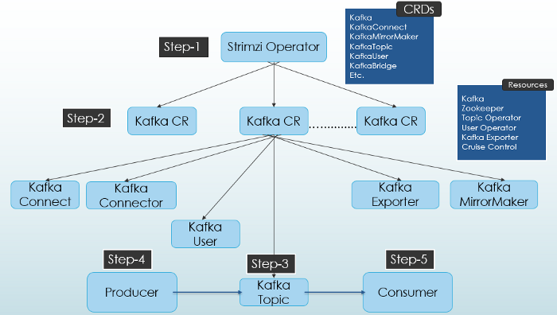

# [kafka](https://kafka.apache.org/documentation/)

Highly scalable distributed streaming platform. Deployment and provisioning of kafka cluster managed by Open
Source Kubernetes operator([strimzi](https://strimzi.io/)).

### Kafka Deployment on Kubernetes using Strimzi

Here is an overview of required steps to deploy kafka cluster on k8s:  


1. **(Step-1)** Initial step is to deploy `Strimzi Kubernetes Operator` (it can be done
   via [helm chart](https://artifacthub.io/packages/helm/strimzi/strimzi-kafka-operator)):
   `Strimzi Operator` automatically creates all
   necessary
   Custom Resource Definitions(CRD)
2. **(Step-2)**.
   To create [kafka cluster](https://strimzi.io/docs/operators/latest/configuring.html#proc-config-kafka-str)
   we can install `kafka` helm chart from _charts/kafka/templates/010-kafka-broker.yaml_. Wait until following kafka pods
   will be up and
   running: `entity-operator`, `zookeeper` and `kafka`.
3. (**Step-3**) Then we can create kafka topics (_charts/kafka/templates/040-topics.yaml_).

4. Steps **4** and **5** (are optional) to send and receive messages and can be replaced by
   installing [kafka-bridge](https://strimzi.io/docs/bridge/latest/)(Rest endpoint) from _
   charts/kafka/templates/020-bridge.yaml_.
   All of above steps applied to create kafka cluster [locally](doc/local_development.md).

### Local development

Before you start please check you Docker preferences. Current local set up works for Docker with **4 cpu** and **10GB
Memory**.
Please follow [local development](doc/local_development.md) instructions.

### Deployment

Deploy as a helm release `my-kafka`:

```
helm upgrade --install my-kafka charts/kafka -n kafka --create-namespace --wait --timeout 600s -f charts/kafka/values-[dev|prod].yaml
```

You can check that cluster is operational by running
following `kubectl` [commands](doc/local_development.md#verify-that-cluster-is-operational).
